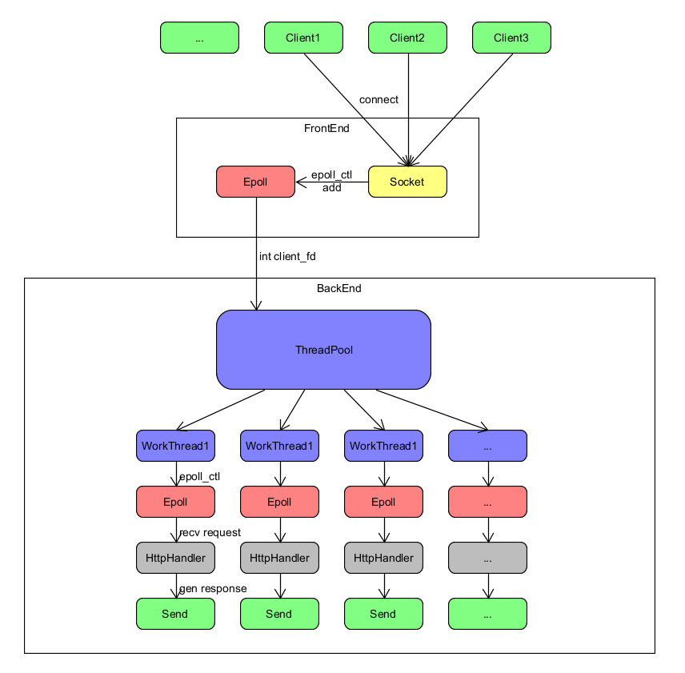
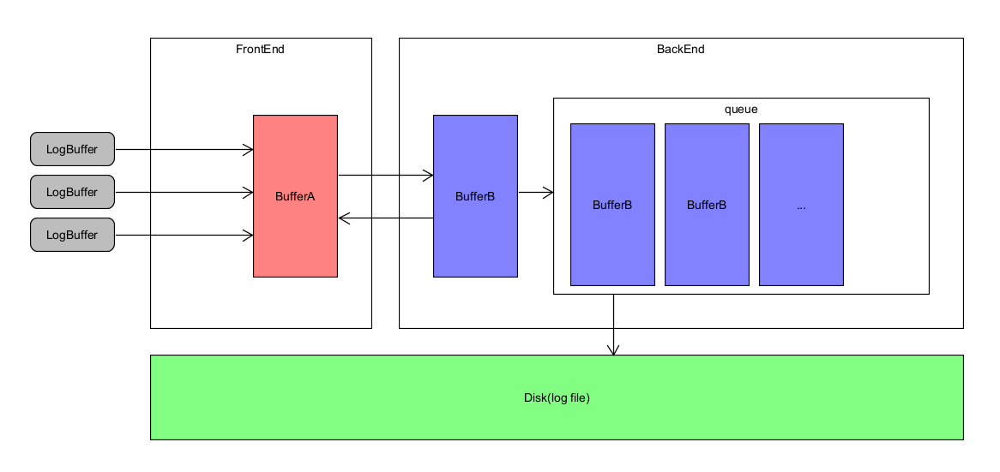

# WebServer

A webserver coded with c/c++ working on linux

## 1. Introduction

This is a static webserver, which was coded with c/c++ on linux. It hanles `GET` requests to generate responses with resources.

Files supported:
+ `htm`/`html`
+ `js`
+ `css`
+ `jpg`/`jpeg`
+ `png`
+ other plain text files

Here is the frame diagram of my project.



With regard to log system, I use a double buffer async log system, here is the log diagram of it.



## 2. Dependences

+ gcc/g++
+ cmake

## 3. How to build

You could build this project in a specific directory, such as `build`. Here is an example below.

```bash
mkdir && cd build
```

```bash
cmake ..
```
In this process, if an error occurred with topics about cmake version, you should modify `CMakeLists.txt` and set a suitable value of `cmake_minimum_required` according to your environment. Then you're able to move on now.

```bash
make
```

```bash
sudo make install
```

`sudo` is neccessary because some directories like `/usr/` and `/var/` might be out of auth.

### 4. How to run

Once you have built the project, you can run the excutable file `webserver` now. `sudo` is neccessary also.

```bash
sudo ./webserver
```

### 5. WebBench

If you want to test the server, `webbench` has already been included.

```bash
cd webbench && make
```

you will get an excutable file `webbench`. Then run it with some params. More information can be found in [webbench/README.md](webbench/README.md). Here is an example, which means it simulates 200 clients using HTTP/1.1 to request the url in 30 seconds.

```bash
./webbench -c 200 -t 30 -2 http://127.0.0.1:your_port/
```

### 6. todo

Since the project is build by such a begginer like me, there are still many works to do. Here is the list.

+ [ ] `post` method
+ [ ] Structure Modify
+ [ ] Memory Pool
+ [ ] Performance Improvement
